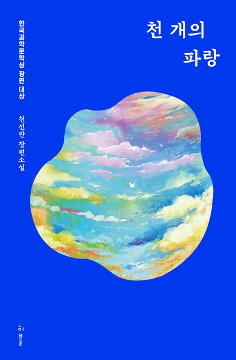

# **독서 기록**
---

# **책 정보**
---

| **제목** | 천 개의 파랑    |
| **저자** | 천선란         |
| **출판** | 허블          |
| **발매** | 2020.08.19   |

# **느낀 점**
---
## **수정**
천선란 작가님의 작품을 이 책으로 처음 접해본다. 서두에 “동식물이 주류가 되고, 인간이 비주류가 되는 세상을 꿈꾼다.”라는 말을 남기셨다. 이 책의 주제의식이 강하게 묻어나는 문장이다. 이 책은 비주류에 대해 이야기한다. 가난, 장애, 동물권 등등.. 그중 사회적 약자인 소아 장애를 앓고 있는 은혜 이야기가 매우 감명 깊었다.

은혜 이야기가 나올 때 가장 와닿았던 구절이 있다. “너도나도 알아서 잘 살아갈 수 있는데. 반드시 도움이 필요한 것도 아닌데, 그렇지 않으면 안 되는 것처럼 자기들 멋대로 생각하는 게 싫다. 왜 굳이 그렇게 멋있게 살아서 내 존재를 증명해야 하는지 모르겠다. 그냥 여행을 다니며 살고 싶다.“ 정말 공감했던 문장이다. 요즘 드는 생각인데, 꼭 좋은 어른이 될 필요는 없다고 생각한다. 그냥 어른이 되면 된다. 사회가 제시하는 '좋은 어른'의 기준은 대개 특정한 틀에 갇혀 있다. 좋은 대학을 나오고, 좋은 직장을 가지며, 결혼하고 아이를 낳는 삶이 정답은 아니다. 다양한 삶의 방식이 존재하며, 그 어떤 방식이든 존중받아야 한다고 생각한다. 나아가 자신에게 맞는 삶을 사는 것이 진정한 건강한 삶이라고 믿는다.

이어서 은혜 이야기를 하자면, 은혜는 극중 장애인으로 원치 않는 호의를 받는 상황이 있다. 예를 들어 밀어달라고 하지도 않았는데 휠체어를 밀어주는 상황 말이다. 상대가 원하지 않는 호의는 오지랖일 뿐이다. 우리 사회는 인간 다양성에 대한 이해가 매우 부족하다고 생각한다. 정상이 아니면 비정상이 된다. 은혜는 장애가 있으니까 비정상이고, 정상인이 도움을 주어야 된다- 이건 평등 의식이 아니라 선민의식에서 나온 편협한 시각일 뿐이다. 장애는 극복해야 될 문제가 아니다. 그냥 인간의 다양한 삶의 형태 중 하나로 바라보아야 한다. 이러한 사실을 모르는 사람들이 너무나 많다.

그리고 이 책의 주인공이라고 생각하는 보경의 이야기. “보경에게 은혜는 아픈 손가락이었다면 연재는 신경이 손상된 손가락이었다.” 이 구절이 내게 매우 크게 와닿았다. 보경의 심정이 어떨지 가늠조차 되지 않더라. 이상하게 보경의 이야기가 나올 때면 내 이야기처럼 공감이 되고 눈물이 나왔다. 시작부터 꼬여버린 실처럼, 이 가족이 오해를 풀고 행복해질 수 있을까 싶었다. 하지만 콜리가 등장하면서 그 실을 아예 잘라버린다. 그리고 새로운 실로 착착 박음질해준다. 세 모녀가 살았던 기계처럼 차가운 공간이 콜리라는 로봇을 통해 오히려 따뜻한 공간으로 변모한 것이다.

이 책에 나온 현실은 우리가 살고 있는 현실과 크게 다르지 않다. 오히려 정말 가까운 미래일 수도 있다. 앞으로 비주류의 권리에 대해 모두가 많은 관심을 가졌으면 하지만.. “이걸 해결하기 위해서는 어떤 부분을 고치는 게 아니라 처음부터, 아예 다시 프로그래밍을 해야 된다는 말이에요. 이 사회가.”라는 구절이 나오는데, 정말 지구가 리셋되어서 원시시대로 돌아간 후에 인간이 멸종하지 않는 이상.. 인간이 비주류가 되는 세상은 힘들 것 같다. 나 또한 인간으로 태어났기 때문에 인지하지 못하고 실수를 한 적도 많고, 지금도 하고 있고, 앞으로도 많이 할 것이다. 하지만 인간 중심적 사고를 멀리하려는 인식을 아는 것과 모르는 것의 차이는 매우 크다고 생각한다.

이 책으로 첫 번째 독서 토론을 했다. 각자의 의견을 공유하는 과정이 정말 재밌고 신기하더라. 토론을 하면서 떠오른 생각인데, 예전에 읽었던 책에서 소설이든 비소설이든, 작가는 자신의 페르소나를 만들어 정확하게 주제를 전달해야 잘 쓴 글이라는 말을 본 적이 있다. 콜리는 작가의 페르소나로, 작가가 독자에게 전하고 싶은 견해를 정확하게 전달해 준다. 그렇기에 이 책을 접한 많은 사람들이 콜리가 로봇임에도 불구하고 따뜻한 마음을 가진 존재처럼 느끼는 것이 아닐까 싶다.

## **시연**  
여기에 느낀 점을 입력하세요.

## **주희**  
천 개의 파랑은 2035년이 배경인 SF 소설이다. 하지만 2035년은 멀지 않은 미래인 것처럼 SF 장르가 맞나 싶을 정도로 지금과 크게 다를 게 없는 현실적인 문제들을 보여주고 있었다.
다가올 미래에 대한 최근에 이슈되고 있는 문제에 대해 작가의 생각을 풀어 쓴 소설 같다고 생각 되었다.

​안락사 당할 위기에 처한 경주마 '투데이', 하반신이 부서진 채로 폐기를 앞둔 휴머노이드 기수 '콜리', 발달된 기술로 장애를 극복할 수 있지만 돈이 없어 어쩔 수 없이 휠체어에 의지할 수 밖에 없는 '은혜' 등 동물, 로봇, 사회적 약자에 대한 변하지 않는 시선들과 이러한 사회에 대해 비판하고 있다.

작가가 보여주고자 하는 것은 "나쁜 사람은 없다" 라는 것이다.
주인공들이 힘든 것은 어떠한 사람 때문에 힘든 것이 아니라 사회가 그렇게 만들고 있다고 느껴졌다.

이 소설에서 딱히 악을 가지고 행하는 사람은 없다.
자신의 이득만을 위해서 연재한테 다가갔던 지수는 알고보니 베풀 줄도 알고 따뜻한 좋은 아이였던 것과 경기 조작을 했던 관계자도 어떻게 보면 살아가기 위해서 그러한 선택을 할 수 밖에 없었을 것이다.

주인공인 세 모녀는 미래에 대해 불안해하며 과거에서 벗어나지 못하는 사람들 같았다. (회피형 인간들...)
연재는 누구보다 뛰어난 기술을 가졌지만 과거의 아픔과 현재의 벗어날 수 없는 가난 때문에 더 이상 기계를 만지지 않았다.
보경은 지금은 만날 수 없는 소방관(남편)과 함께했던 과거만 되풀이하며 시간이 멈춰버렸다.
은혜는 가난 때문에 바꿀 수 없는 현실에 순응하고 미래에 대해 희망을 품지 않는다.
대화가 단절된 가족이였지만 휴먼노이드 콜리를 만나고 점차 변화해가며 대화하고 이해하는 사이가 되었다.
각자 다르게 흐르던 시간이 딱딱한 기계인 콜리를 통해 같이 흐르게 되었다는 게 모순적이지만 그래서 가능했을거라는 느낌이 들었다.

친구들은 두 딸을 책임지고 있는 보경에 마음이 갔다고 했지만, 나는 휴먼노이드 기수 콜리의 인간적인 면에 대해 공감하고 감정 이입을 많이 했다.
겉으로 보면 오류가 난 기계일 뿐일지라도 이미 인간적인 사고를 시작한 것부터 나는 콜리를 로봇으로 생각하지 않고 책을 읽기 시작했던 거 같다.
더 이상 달릴 수 없을 것 같은 투데이를 위해 자신이 잘못 될 것을 알고도 두 번이나 낙사하고 사람들의 이야기를 들어줌으로써 치유를 해주는 등 이 책에서 콜리는 매개체로써 역할을 보여줬지만 나는 이러한 콜리에 대해 더욱 마음이 갔던 거 같다.

## **후정**  
여기에 느낀 점을 입력하세요.