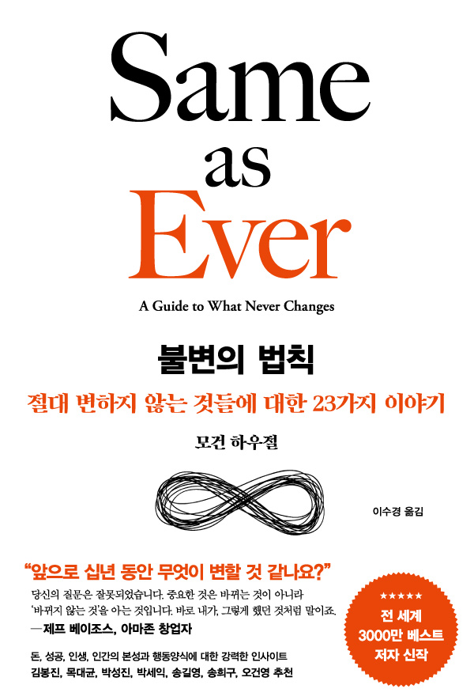

# **독서 기록**
---

# **책 정보**
---

| **제목** | 불변의 법칙   |
| **저자** | 모건 하우절   |
| **출판** | 서삼독       |
| **발매** | 2024.02.28 |

# **느낀 점**
---
## **수정**
모건 하우절의 이름빨을 받아 기대하고 펼친 책이었는데, 생각보다 당연한 얘기만 줄줄 써져있어서 실망스러웠다. 책 자체는 제목 그대로 이 세상에서 변하지 않는 법칙들을 다양한 예시들을 나열해 설명한다. 세세하게 23장으로 나누어져 있지만 일맥상통하는 주제들이 보였다. 복리 효과, 보이지 않는 것들의 힘, 유연성, 역경을 통한 성장.. 등으로 추릴 수 있을 듯. 실망했던 점은 이 세상의 변하지 않는 가치들을 깊이 있게 알아가는 시간을 가질 줄 알았는데, 생각보다 장황하고 깊이가 얕았다. 책이 재미가 없으니 으레 안 읽히더라. 좀 더 보강했으면 하는 부분은 비슷한 챕터는 묶고, 예제도 줄이고, 더 구체적인 방향성을 제시해 줬으면 좋았을 것 같다. 이러이러한 법칙이 있으니까, 이러이렇게 행동해라. 이런 식으로. 요론 챕터도 물론 있었지만 아닌 챕터가 더 많았던 거 같아서. 이게 개념서는 아니니까.. 작가의 개인적인 통찰과 깊이가 있었으면 좋았을 것 같다.

### **생각해 보면 좋을만한 질문** 💡  
**Q. 맞는 말을 하고 있지만 스토리텔링이 형편없어서 내가 귀 기울이지 않게 되는 사람이 있는가?**   
A. 질문이 역설적인 게.. 내가 귀 기울이지 않기 때문에 맞는 말을 하는지 안 하는지 관심이 없어서 몰라.
그런 사람이 있었어도 이미 기억 저편으로 날아갔어..

**Q. 현재 내가 가진 견해 중 만일 다른 나라에 태어났거나 다른 세대에 속했다면 동의하지 않을 만한 것이 있는가?**  
A. 다른 나라에 태어나거나 다른 세대에 속해본 적이 없어서 구체적인 예시를 들지는 못하겠어.
근데 당연히 지금의 나와 견해가 다르겠지..

**Q. 사실이었으면 하는 마음이 너무 간절해서, 분명 사실이 아님에도 내가 사실이라고 믿는 것은 무엇인가?**  
A. 권선징악

**Q. 결국에는 나도 겪게 될 문제인데 다른 나라, 다른 업계, 다른 직종에만 해당한다고 생각하는 문제는 무엇인가?**  
A. 뭐 나라 업계 직종 이런 건 아닌데 아직까지 크게 와닿지 않는 건 노화. 나이를 먹으면 새로운 것에 대한 적응이 어려워지잖아. 지금만 해도 어르신들 키오스크 어려워하시고. 그런데 우리가 늙었을 때 얼마나 세상이 발전했겠어.. 근데 그걸 따라갈 수 있을지에 대한 걱정은 하긴 하는데, 그냥 오늘 점심 뭐 먹지? 랑 비슷한 급으로 여기는 것 같아.

**Q. 내가 진실이라고 믿지만 사실은 영리한 마케팅의 결과에 불과한 것은 무엇인가?**  
A. 최근에 알게 된 점은 제로 칼로리가 정말 제로 칼로리가 아니라더라. 4칼로리 미만은 0칼로리로 표기할 수 있다고 하대. 그리고 장내미생물에 영향을 줘서 장 건강이 안 좋아질 수도 있대. 실제로 난 생귤탱귤 제로 아이스크림이랑 메가커피 제로 아이스티를 먹고 ㅍㅍㅅㅅ를 한 적이 있어..

**Q. 내가 직접 경험하지 못해서 무지할 수밖에 없는 대상이나 문제는 무엇인가?**  
A. 여러 가지 있겠지만 지금 생각나는 건 출산. 최근에 출산의 진실에 관한 글을 읽었는데, 출산 후유증에 대해 처음 알게 됐어.
1. 출산할 때 회음부를 절개하는데, 나중에 다시 봉합할 때 마취도 못하고 생살을 꿰매야 된대.. 아물 때까지 고통이 길면 한 달 정도 지속되어서 제대로 앉지도 서지도 못한다고 하더라.
2. 오로라고 자궁이 수축하면서 안에 있던 태반, 찌꺼기들을 배출한대. 그것 때문에 2주 동안 풀타임 생리를 해야 한대
3. 직장 질루라는 질환이 생기면 질과 직장 사이에 길이 생겨 항문으로 나와야 하는 대변이 질로 나오게 된대. 너무 충격적인 게 이 병명만 들으면 흔한 일이 아닐 거라고 생각이 들잖아. 근데 10명 중에 2명 정도 걸리는 흔한 질환이래.
학교에서 배울 때는 이런 점을 안 가르쳐 줘서 10달 품고 낳으면 끝인 줄 알았는데, 출산 후유증을 알게 되니까 이 세상 엄마들이 진짜 존경스러워졌어..

**Q. 오래 못 갈 것처럼 보이지만 사실은 우리가 아직 받아들이지 못한 새로운 트렌드에 해당하는 현상은 무엇인가?**  
A. 첫 번째는 안락사 캡슐 사르코. 캡슐 사용자가 버튼을 누르면 질소가 뿜어져 나와서 30초 안에 저산소증으로 사망하는 기계야. 현재는 윤리적, 법적 문제로 논란이 많지만 언젠가는 상용화되지 않을까 싶어. 안아프게 죽는게 얼마나 큰 복일까~
그리고 두 번째는 뇌에 칩 이식. 일론 머스크의 뇌 임플란트 스타트업 뉴럴링크가 인간의 뇌에 컴퓨터 칩을 심는데 성공했대. 사지 마비된 한 남성이 뇌에 칩을 이식받은 후 온라인 체스 게임을 즐기는 모습이 처음으로 공개됐는데 생각만으로 마우스 커서를 움직일 수 있대. 아직은 거부감이 크지만 나중에는 모두가 머리에 칩을 심고 있을 것 같은 느낌이야..

**Q. 만일 나의 인센티브가 달라진다면 현재 나의 견해 중 어떤 것이 바뀔까?**  
A. 이 질문에 대한 대답을 가장 오래 고민한 거 같아.. 그만큼 예상이 잘 안되는데.. 내 경험을 토대로 얘기해 보면
지위가 높아지고 받는 게 많아질수록 열정이 줄고 현실에 순응하게 되지 않나.. 그리고 좀 거만해질 수도 있다? 내가 반골 기질이 좀 있는데 그것도 많이 줄어드는 것 같아.

**Q. 현재 우리가 간과하고 있지만 미래에는 너무나 명백하거나 당연해질 현상이나 문제는 무엇인가?**  
A. 저출생과 고령화로 인한 문제들. 지금 당장 알고는 있어도 피부에 와닿지는 않는데, 우리가 장년층이 되면 지금보다 더 극단적인 상황이 될 거라고 생각해. 유튜브에서 미래에 대해 뇌절의 뇌절을 하는 채널을 봤어. 그중에 미래에는 학생이 대학을 선택하고 교수가 면접을 보는 영상도 있더라. 무슨 집 하나를 4명이서 월세 내고 공간을 나누어서 사는 것도 있고. 웃기려는 의도로 만든 영상이었지만 정말 미래에는 이렇게 될 수도 있겠구나 생각이 들더라.

**Q. 일어나기 직전까지 갔지만 실제로는 일어나지 않은, 하지만 만일 일어났다면 세상을 완전히 바꿔놓았을 사건은 무엇인가?**  
A. 뭐 여러 가지 있겠지만 지금 생각나는 건 히틀러가 미대에 붙었다면? 정말 많은 것들이 바뀌었을 것 같아.

**Q. 나의 통제 바깥에 있는 요소나 힘이 내가 인정받은 성과에 얼마나 기여했는가?**  
A. 내 인생에서 운 좋았을 때를 생각해봤는데 막상 떠오르지가 않네.. 뭐 여러가지 있었겠지

**Q. 내가 인내심이 있는 것인지(능력) 고집을 부리는 것인지(단점)를 어떻게 알 수 있을까?**  
A. 주변 사람들의 반응. 특히 가족들이 말리면 그게 고집이겠지.. 근데 난 고집이 나쁘다고 생각하지 않아. 어차피 인생 모 아니면 도 아님? 뭐 하나 시작하면 끝장을 보는 것도 좋다고 생각해. 중간에 멈추면 나중에 후회들 많이 하잖아. 그때 그거 해볼걸. 이럼서. 설사 그게 진짜 똥고집이었어도, 차라리 그냥 끝까지 가는 게 낫다. 주변인은 좀 힘들 수 있겠지만.. 고집이란 게 좋게 말하면 강단 있고, 자기 소신 있고, 개성이 강하다는 말인데. 난 좋아.

**Q. 나는 진짜 모습은 형편없는 누군가를 존경하고 있지는 않은가?**  
A. 내가 존경하는 사람의 진짜 모습은 형편없을 수도 있겠지. 근데 그것을 잘 숨기고 사회적 가면을 쓰는 것도 대단한 거라 생각해. 그 모습 또한 그 사람의 일부이고, 또 숨기는 것도 능력이지.

**Q. 성공을 위해 꼭 치러야 하는 비용임에도 불편함이나 골칫거리, 성가신 문제를 없애려고만 하고 있지는 않은가?** 
A. 성공을 위해 치러야 할 비용에는 시간, 노력, 심리적 부담 등이 있겠지.. 이런 비용은 스트레스를 동반하기 때문에 피하려고 하는 경우가 많고. 개인적으로 이 세상에 지름길은 없다고 생각해. 결국 부족한 부분은 나중에 나에게 영향을 주게 돼있더라고. 그래서 난 정공법으로 나아가려고 노력하는 편이야.

**Q. 내가 닮고 싶어 하는 미친 천재가 사실은 그저 미치광이에 불과하지는 않은가?**  
A. "미치광이"의 사전적 의미를 찾아봤는데, 일반적으로 정신적으로 불안정하거나 이상 행동을 하는 사람을 가리키는 표현이래. 정신병자랑 비슷한 맥락인가? 내가 닮고 싶은 사람들 중에 미치광이는 없어..

**Q. 내가 지닌 확고한 신념이나 견해 중 앞으로 바뀔 가능성이 높은 것은 무엇인가?**  
A. 비혼? 솔직히 한 사람과 평생 같이 살 자신도 없지만 내 아이를 낳아보고 싶기도 해.

**Q. 지금껏 늘 옳았던 것은 무엇인가?**  
A. 할까 말까 할 때는 해라. 안 하면 평생을 후회하면서 산다

**Q. 시간이 흘러도 변하지 않는 것은 무엇인가?**  
그런 게 있을까? 10년이 지나면 강산도 달라지는데.. 시간이 흐르면 모든 것은 변한다고 생각해.

## **시연**  
여기에 느낀 점을 입력하세요.

## **주희**  
당연한 말을 여러 역사에 근거하여 아주 짧게 설명하는데 불변의 법칙을 공감하려는 순간 다음 챕터로 넘어가서 지식만 허투루 쌓인 기분이였다.

왜 필독서이고 베스트 셀러인 지 모르겠다.
차라리 역사에 대한 이야기를 먼저 보여주고 역사의 통찰력을 독자가 직접 이해하는 식이면 좋겠다는 아쉬움이 강했던 책이다.

### **생각해 보면 좋을만한 질문** 💡  

**1. ​맞는 말을 하고 있지만 스토리 텔링이 형편없어서 내가 귀 기울이지 않게 되는 사람이 있는가?**
평소에도 관심 없는 분야에는 귀 기울여서 듣는 편이 아님.

**2. 현재 내가 가진 견해 중 만일 다른 나라에 태어났거나 다른 세대에 속했다면 동의하지 않을 만한 것이 있는가?**
나는 죽으면 아무것도 아닌 상태가 된다고 생각한다. 인간에게 죽음은 죽지 않는 이상 겪어볼 수 없는 것이기에 바라는 대로 정의가 내려지기 마련이다. 종교 사상이 뚜렷한 나라에 태어났거나 수 세기 전이나 수 세기 후에 태어났다면 환경에 의해 내 견해는 달랐을 것이다.

**3. 사실이었으면 하는 마음이 너무나 간절해서, 분명 사실이 아님에도 내가 사실이라고 믿는 것은 무엇인가?**
없음. 질문 넘 어려움.

**4. 결국에는 나도 겪게 될 문제인데 다른 나라, 다른 업계, 다른 직종에만 해당한다고 생각하는 문제는 무엇인가?**
저출산 고령화 문제. 물론 우리나라도 해당되는 문제이지만 나에게 직접적으로 치명적이지 않은 문제이다. 하지만 결국에는 나도 겪게 될 문제라고 생각한다. 현재의 문제는 국가의 재정위기, 저출산으로 인한 실업, 고령화로 인한 새 직종 생성 필요. 내가 겪게 될 문제는 내 아이가 살아가고 배워갈 수 있는 교육 환경인가. 내 직종도 없어질 수 있음. 연금 수령 못할 수 있음.

**5. 내가 진실이라고 믿지만 사실은 영리한 마케팅의 결과에 불과한 것은 무엇인가?**
백신이나 영양제. 우리나라는 태어났을 때부터 예방접종을 시작한다. 영양제 또한 건강을 보존하기 위해 가지각색으로 챙겨먹는다. 건강하기 위해서 의학에 의존할 수 밖에 없겠지만, 일부분은 유도하기 위해 사용되는 마케팅 전략이라 생각한다.

**6. 내가 직접 경험하지 못해서 무지할 수밖에 없는 대상이나 문제는 무엇인가?**
우주라고 생각한다. 우주는 과학자들이 증명해 낸 이론이며 직접 도달해본 인간도 있다고 하지만 알 수 없는 존재이다. 내가 경험해보지 못한 이상 무지하며 무한한 대상이다.

**7. 오래 못 갈 것처럼 보이지만 사실은 우리가 아직 받아들이지 못한 새로운 트렌드에 해당하는 현상은 무엇인가?**
AI 기반 맵핑 시스템. AI가 스스로 학습해서 정해진 길이 아닌, 스스로 길을 선택해서 가는 일.

**8. 똑똑해 보이지만 사실은 헛소리만 하는 허풍쟁이는 누구인가?**
정치인? ㅋㅋ 생각해본 적 없음. 별로 생각하고 싶지도 않은 질문.

**9. 나는 상상하지 못한 리스크에 제대로 대응할 준비가 돼 있는가?**
준비되어 있지 않다. 하지만 상상할 수 있는 리스크는 항상 상상해두는 편이다. 내가 교통사고가 난다면? 암이 발병한다면? 좀비같은 아포칼립스가 시작된다면? 과 같은 ... 상상하지 못한 리스크는 어떻게 대응할 지 모르겠다.

**10. 만일 나의 인센티브가 달라진다면 현재 나의 견해 중 어떤 것이 바뀔까?**
일을 하기 위해서는 충분히 쉬고 자유로워야 한다. 워라벨에 대해 중요하게 생각하는 편이지만 인센티브가 많아진다면 워라벨을 포기할 수 있는 사람이 될 것 같다. 젊을 때 돈 많이 벌고 나중에 많이 쉬자로 바뀔 듯.

**11. 현재 우리가 간과하고 있지만 미래에는 너무나 명백하지만 당연해질 현상이나 문제는 무엇인가?**
AI 로봇의 발전으로 인한 반란, 전쟁. OpenAI CEO 샘 알트먼이  인공지능 기술에 대한 안전보다는 이익을 우선시 하는 행태를 일부분이 마음에 들어하지 않으며 해고가 되었다. 

**12. 일어나기 직전까지 갔지만 실제로는 일어나지 않은, 하지만 만일 일어났다면 세상을 완전히 바꿔놓았을 사건은 무엇인가?**
소련의 수소폭탄으로 인한 제 3차 세계대전. 물론 지금도 미.러 3차 세계대전을 예언하는 사람들도 있긴 하다. 미국이 먼저 핵폭탄을 만든 뒤 소련이 뒤늦게 핵폭탄 개발을 시작했고 암묵적인 기술 전쟁이 시작되었다. 이러한 기술로 우주를 여행할 수 있는 로켓이 발전하고 저렴한 자원으로 광대하게 사용할 수 있는 원자력 발전소가 생겨났지만 이는 강국을 위한 개발 중 하나이다. 소련이 몰락하였기에 일어나지 않은, 실제로 일어났다면 세상이 존재하지 않았을 사건이라고 생각한다.

**13. 나의 통제 바깥에 있는 요소나 힘이 내가 인정받은 성과에 얼마나 기여했는가?**
(-) 가 된다. 요소나 힘이 성과에 좋은 영향을 주기보다는 안 좋게 만들 수 있다. 성과가 좋아지면 나의 능력.

**14. 내가 인내심이 있는 것인지(능력) 고집을 부리는 것인지(단점)를 어떻게 알 수 있을까?**
나는 내가 알고있을 것이라 생각

**15. 나는 진짜 모습은 형편없는 누군가를 존경하고 있지는 않은가?**
존경하는 사람이 많지 않은 편이다. 인간이라면 형편없는 부분도 있다고 생각한다. 완벽한 사람은 없다. 고로 형편없는 부분도 수용할 수 있다고 생각한다.

**16. 성공을 위해 꼭 치러야 하는 비용임에도 불편함이나 골칫거리, 성가신 문제를 없애려고만 하지 않는가?**
내가 이직을 하지 않는 것. 스펙 쌓고, 이력서 넣고, 면접 보는 게 귀찮고 실패할까봐 회피하는 것 같다. 굳이 도전하지 않아도 이 회사를 계속 다닐 수 있으니깐. GPT에 의존하는 요즘도 마찬가지. 기초를 공부하지 않고 응용을 공부하려고 함.

**17. 내가 닮고 싶어 하는 미친 천재가 사실은 그저 미치광이에 불과하지 않는가?**
미쳐야지 천재가 됨.

**18. 내가 지닌 확고한 신념이나 견해 중 앞으로 바뀔 가능성이 높은 것은 무엇인가?**
지금 생각하는 행복의 가치가 미래에는 바뀔 것.

**19. 지금껏 늘 옳았던 것은 무엇인가?**
공부 열심히 하는 것.

**20. 시간이 흘러도 변하지 않는 것은 무엇인가?**
생활 습관. 미루는 사람은 계속 미룰 것. 미룬이!!!!!!!!

## **후정**  
여기에 느낀 점을 입력하세요.