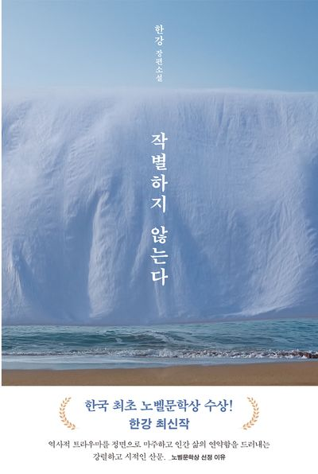

# **독서 기록**
---

# **책 정보**
---

| **제목** | 작별하지 않는다  |
| **저자** | 한강    |
| **출판** | 문학동네   |
| **발매** | 2021.09.09   |

# **느낀 점**
---
## **수정**
표지를 보면, 바닷가 풍경에 무명천이 가리워져 있다. 이는 과거 파도가 시신을 쓸어가며 흔적을 지워버린 비극적인 기억을 떠올리게 한다. 희생자들의 죽음을 기리고자 바닷가에 덮인 무명천은 잊혀진 고통과 남겨진 이들의 애도를 상징하는 듯하다.

소설은 경하, 인선, 정심이라는 세 여성의 시점이 교차하며 진행된다. 처음에는 경하가 주인공인 듯했다가, 이야기가 전개될수록 인선으로, 그리고 마지막에는 정심으로 중심이 이동한다. 마치 이어달리기를 하듯, 세 여성은 서로의 고통과 기억을 이어받으며 하나의 큰 이야기를 완성해 간다.

눈은 이 작품에서 중요한 소재로 등장하는데, 책을 읽다 보면 휘몰아치는 눈에 압도당하곤 한다. 눈은 문학에서 흔히 고통의 상징으로 사용되지만, 여기서는 과거와 현재를 잇는 매개체로서도 기능한다. 인선의 어머니와 이모가 학살당한 가족의 시신을 찾기 위해 눈을 헤치던 장면이나, 쓰러진 경하의 얼굴 위로 눈이 쌓이는 장면은 수미상관한다.

1부에서 경하는 인선의 부탁으로 앵무새 '아마'를 돌보기 위해 제주로 떠난다. 폭설과 길을 잃는 극한의 상황 속에서 힘겹게 인선의 집으로 도착하게 된다. 이는 단순히 물리적 여정이 아니라, 비극적 역사와 개인적 상처를 직시하고 감내해야 하는 정신적 여정을 의미한다.

​
앵무새는 말하는 동물이다. 말이라는 행위는 기억과 소통을 뜻하기도 한다. 결국 아마는 죽음으로써 더 이상 말을 할 수 없게 된다. 이는 4.3 사건의 희생자들이 증언할 기회를 잃은 채 역사에서 잊히고 지워진 현실을 반영하는 듯 했다. 그렇게 가볍고 약한 새도 손바닥에 올라오면 날카로운 발톱이 손바닥을 긁는다는 표현이 인상 깊었다.

​
손가락 봉합수술 이후 3분에 한 번씩 바늘에 찔리는 고통을 느껴야만 손가락이 썩지 않듯이, 우리는 고통을 느껴야 한다. 그날의 고통과 죽음, 안타까움을 기억해야만 한다. 잘린 손가락을 봉합시키지 않으면 평생 동안 환상통에 시달린다고 한다. 대한민국은 손가락이 잘린 것처럼, 그러한 사건이 존재하지 않는 것처럼 지냈고 오랜 시간 동안 환상통에 시달렸다. 올바른 진상 규명을 위해, 이제는 손가락을 찔러야 한다. 고통을 느껴야 한다.

현재 제주평화기념관에는 백비가 누워져 있다. 백비는 '어떤 까닭이 있어 글을 새기지 못한 비석'이라고 한다. 긴 세월이 지난 후에도 아직 올바른 역사적 이름을 얻지 못했기 때문이다. 비석이 이름을 얻고 다시 세워질 그날까지, 우리는 작별하지 않는다.

소설 출간 이후인 2022년부터 유족들에게 보상금 지급과 무죄 선고가 이루어졌다고 한다. 비록 오랜 시간이 걸렸지만, 이는 진실 규명을 향한 작은 발걸음이며 앞으로도 계속되어야 할 과제이다.

## **시연**  
제주 4.3 사건에 대한 배경지식을 가지고 읽는다면, 더욱 몰입할 수 있는 책
첫 챕터를 읽으면서, 한강 작가가 자신의 이야기를 써내려가고 있다는 느낌을 받았다. 이 사건을 공부하며 느낀 참담함을 고스란히 글로 풀어낸 것 같았다. 책 속에는 수많은 은유가 깃들어 있다.
무고하게 죽음을 받아들여야 했던 시민들을 앵무새 아미로, 이들의 고통을 알리고 잊지 않겠다는 결의를 눈 속 작은 불꽃으로 은유한 것처럼 느껴졌다.

그중에서도 가장 인상 깊었던 것은 눈이었다.
책에서 눈은 정말 다채롭게 묘사된다.

한강 작가의 여러 작품을 읽다 보면 느껴지는 독특한 재능이 있다. 참혹하고 비참한 상황을 아름다운 언어로 형상화한다는 점이다. 채식주의자에서는 그것이 “꽃”으로 다가왔고, 작별하지 않는다에서는 “눈”으로 다가왔다.

1부 새에서 인선의 집으로 찾아가는 폭설 속 배경은 아직도 잊을 수 없다.

“다섯 살 모습으로 내가 눈밭에 앉아 있었는데. 내 뺨에 내려앉은 눈이 이상하게 녹지를 않더래. 꿈속에서 엄마 몸이 덜덜 떨릴 만큼 그게 무서웠대. 따뜻한 애기 얼굴에 왜 눈이 안 녹고 그대로 있나.”
“그들의 얼굴에 쌓였던 눈과 지금 내 손에 묻은 눈이 같은 것이 아니란 법이 없다.”

제주 4.3 사건 당시 부모와 형제를 잃은 뒤, 그들의 시신 위에 쌓인 눈. 그리고 경하가 경험한 눈.
이 두 가지가 겹쳐지면서 이 소설에 더 깊이 몰입할 수 있었다. 읽는 내내 마치 내가 경하가 된 듯한 느낌이었다.

책을 완독한 후, 숙연하고 잔잔한 울림 속에서 작가의 말을 읽으며 가장 큰 충격을 받았다.

“몇 년 전, 누군가 다음에 무엇을 쓸 것이냐고 물었을 때 사랑에 대한 소설이기를 바란다고 대답했던 것을 기억한다. 지금의 내 마음도 같다. 이것이 지극한 사랑에 대한 소설이기를 빈다.”

이 책은 감히 작별할 수 없고, 작별해서는 안 되는 사랑에 대한 이야기였다.

## **주희**  
'채식주의자'를 이어서 두 번째 읽는 한강 작가님의 책
한강 작가의 필력은 읽을 때마다 경이롭다.
수준 높은 단어들을 한 문장 안에 나열하면서 나도 모르게 소설 속에 매료되어 있다.

​
이 책의 첫 문장,

>성근 눈이 내리고 있었다.

​
한글의 위대함을 느끼며 언어적 결핍이 느껴졌다.
노벨문학상을 원문 그대로 접할 수 있어서 다행이다.

​
주인공이 버스를 타고 있었는데 한순간에 눈보라에 갇힌 장면과 환상, 즉 인선의 혼과 대화하는 장면으로 넘어가는 등 설명을 생략한 전환으로 앞으로 돌아가서 다시 읽은 부분이 많았다.
소설이라면 표현 되었을 부분이 생략됨으로써 소설적 편견을 깨트려서 신선했다.

인선의 새를 통해 나와 가까운 관계가 아닌 존재여도 슬픔으로 고통스러울 수 있다는 것을 보여주며 제주 4.3 사건의 주민들의 죽음은 얼마나 더 슬프고 고통스러울 것인가에 대해 빗대어 볼 수 있었다.
죽은 새의 혼이나 인선의 혼 등 환상을 보며 생과 사의 경계가 모호해지며 과거의 고통을 회상하고 그들과의 작별이 불가능하다는 것을 상징적으로 보여준 것 같다.
​

역사의 아픔을 3인칭 대화 형식으로 읽어내며 인선의 가족 이야기 뿐만 아니라 그 때 당시의 제주도 주민들을 가까이서 만나본 것 같았다.

우리가 고통을 직접 느껴본 것도, 내 가족 일이 아니여도 이렇게 가슴이 아픈데 많은 사람들이 고통을 안고 살았을 지 생각하면 먹먹하다.
당시의 사람들은 어떻게 견뎌내고 지켜냈는가 싶었다.
우리 역사의 비극을 들춰내며 그들을 해방시켜야 한다.

역사를 좋아하고 컨텐츠를 즐겨보는 사람으로 이 책을 읽고 제주 4.3 사건을 열심히 찾아봤다.
알고있던 역사였지만 책을 읽고 접하니 마음 깊숙히 와닿았다.

소년이 온다를 읽다가 현 사건이 터졌다.
그래서 서울의 봄을 찾아보고 광주 5.18 역사도 공부했다.
역사를 다룬 창작물은 기억이라고 생각한다.
우리가 살아가게 된 이유를 기억으로부터 보존해야한다.

## **후정**  
책을 처음 읽기 시작했을 때는 생각보다 실망했다. 한강이라는 이름에 거는 기대가 컸던 탓인지, 계속해서 변화하는 시간의 흐름이 어색하게 느껴졌다.
본격적으로 책에 빠져들었던 건 2부부터였다. 2부는 전보다 더 깊게 인선의 아버지와 어머니의 일화를 풀어나갔다. 과거에 인선의 아버지와 어머니가 들려주었던 이야기를 회상하는 모습에 나도 모르게 빠져들었다.

사투리를 그대로 인용하여 들려주는 이야기들이 너무나도 생생하고 눈앞에 그려졌다. 과거에 이런 일이 있었다는 것을 알고 있었음에도 너무 놀라웠고 동시에 격분하게 했다. 실제로 제주도에는 일본의 핍박으로 인해 공산주의를 가진 사람들이 꽤 많이 살았다고 한다. 하지만 공산주의가 만연하게 퍼지는 것이 두려워 학살한 행동이 과연 옳은 것일까? 게다가 희생당한 3만 명의 제주도민 중 무고한 이들은 얼마나 많았을까?

소설 속에서 끊임없이 등장하는 눈, 차갑지만 따듯하게 묘사되었던 눈은 이 참사에서 무고하게 희생된, 그리고 남은 이들을 일컫는 게 아닐까 싶다. 극 중에 바깥의 상황보다 눈 속이 더 포근했다는 표현이 있는데, 사실 우리가 눈 속에 들어가면 포근하다는 느낌보다 차가움이 더 크게 느껴질 것이다. 이들이 포근하다고 느꼈던 것은 크나큰 고통에 체념한 것이 아닐까. 동시에 눈은 시체 더미에 쌓인 눈을 치우며 가족들을 찾게 한 **사랑**이자, 직접 상처를 내어 동생의 입에 물려주는 **고통**을 의미하는 것으로 느껴졌다.

마지막에 경하와 인선은 나무들을 심을 땅을 보러 어둠 속으로 걸어갔다. 이후 경하와 인선이 어떻게 되었는지는 알 수 없다. 하지만 둘의 만남이 그저 꿈인지, 죽음인지는 중요하지 않았다. 오히려 비현실적인 만남이 사건을 더 극대화하는 것으로 느껴졌다.
우리의 비극을 다시 한번 일깨워 준 책이었다. 희생자들이 더는 힘들지 않았으면 좋겠다.
