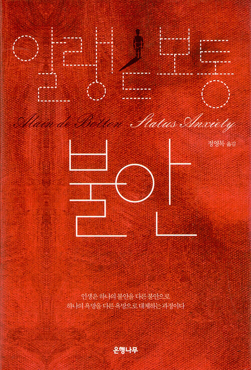

# **독서 기록**
---

# **책 정보**
---

| **제목** | 불안  |
| **저자** | 알랭 드 보통    |
| **출판** | 은행나무   |
| **발매** | 2012.01.04   |

# **느낀 점**
---
## **수정**
우리는 살아가면서 크고 작은 불안을 느낀다. 특히 현대 사회에서 불안은 더 이상 개인적인 문제가 아니라 사회적, 구조적인 문제로 자리 잡았다. 알랭 드 보통의 불안은 우리가 왜 불안을 느끼는지, 그리고 그 불안이 어디에서 비롯되었는지를 깊이 있게 탐구한 책이다. 이 책을 읽으면서 내가 평소에 느꼈던 불안의 근원이 무엇인지 돌아볼 수 있었고, 사회적 기대와 비교에서 벗어나야 한다는 점을 다시금 깨닫게 되었다.
​

책에서는 불안의 주요 원인으로 ‘사회적 지위’를 꼽는다. 우리는 성공과 실패를 단순히 개인의 노력이나 실력으로만 평가하지 않고, 사회적 기준에 의해 끊임없이 비교당한다. 특히 현대 사회에서는 부, 명예, 직업적 성취가 곧 개인의 가치를 결정짓는 요소로 작용하고 있다. 나 역시 무의식적으로 남들과 나를 비교하며 불안을 느꼈던 적이 많다. 책을 읽으면서 그러한 불안이 단순히 나의 문제가 아니라, 사회 구조와 문화에서 비롯된 것임을 깨달았다. 저자는 이러한 불안의 근원을 철학적, 역사적 관점에서 분석하며, 몽테뉴나 스토아 철학자들의 사례를 들어 우리가 어떻게 불안을 극복할 수 있는지에 대한 방향을 제시한다.

책에서 가장 인상 깊었던 부분은 ‘타인의 시선을 의식하는 삶이 결국 불안을 키운다’는 내용이었다. 우리는 흔히 타인의 인정이 있어야만 내 가치가 증명된다고 생각하지만, 실상은 그 인정 자체가 모호한 기준에 의해 만들어진 허상일 수 있다는 점이 흥미로웠다. SNS가 발달하면서 사람들은 더 많이 비교하고, 더 많은 불안을 느끼게 되었다. 책을 읽으면서 결국 중요한 것은 ‘내가 나를 어떻게 바라보느냐’이며, 이를 위해서는 외부의 기준이 아니라 내면의 성장을 중심으로 살아가야 한다는 생각이 들었다.

​
책을 통해 얻은 가장 큰 교훈은 불안에서 벗어나기 위해서는 비교를 멈추고, 스스로의 가치를 인정하는 연습이 필요하다는 점이다. 저자는 예술, 철학, 문학을 통해 삶의 의미를 찾을 수 있다고 조언하며, 물질적 성공에 집착하는 대신 나만의 기준을 세우는 것이 중요하다고 강조한다. 이 부분을 읽으며, 나도 앞으로는 남과의 비교보다는 내 삶의 방향성과 만족도를 우선시해야겠다고 다짐하게 되었다.

## **시연**  
여기에 느낀 점을 입력하세요.

## **주희**  
여기에 느낀 점을 입력하세요.

## **후정**  
여기에 느낀 점을 입력하세요.

