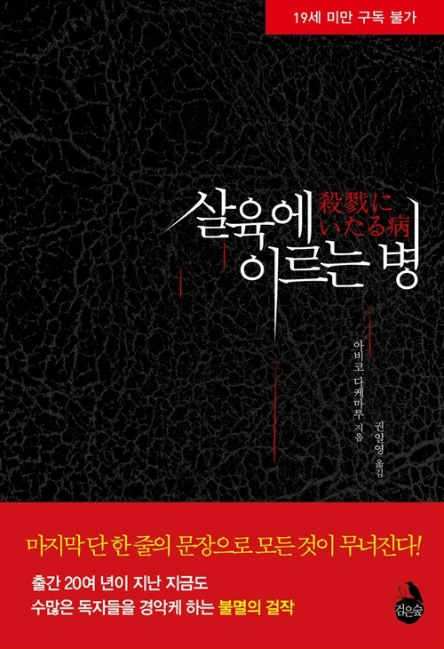

# **독서 기록**
---

# **책 정보**
---

| **제목** | 살육에 이르는 병  |
| **저자** | 아비코 다케마루    |
| **출판** | 검은숲   |
| **발매** | 1992   |

# **느낀 점**
---
## **수정**
90년대 특유의 시대적 한계가 느껴지는 설정이지만, 당시에는 꽤 신선했을 법한 방식이라는 생각이 들었다. 지금이라면 기술 발달로 인해 금방 들통날 범죄 방식일텐데, 오히려 그런 점이 작품 속 긴장감을 더해주는 요소로 작용한 듯했다.

마지막 반전은 정말 충격적이었다. 보통 오래된 소설의 트릭은 여러 작품에서 차용되어 이미 익숙한 경우가 많은데, 이 작품의 반전은 그동안 접하지 못했던 방식이라 더욱 놀라웠다. 일본의 사회적·문화적 특성을 절묘하게 활용한 점이 인상 깊었다. 또한 일본 특유의 음침함은 진짜 따라갈 수가 없겠구나 싶었다.

개인적으로 고어물은 영상보다 글로 묘사될 때 훨씬 더 섬뜩하게 다가오는데, 이 작품도 그런 면에서 강렬했다. 상상력을 자극하는 묘사는 오히려 화면으로 보는 것보다 더 깊은 공포를 느끼게 했다. 주인공은 정말 성 도착증에 가까운 사이코패스 그 자체였다고 생각한다. 그의 비정상적인 심리와 행동이 책을 읽는 내내 불쾌함을 느끼게 했다.

복선이 워낙 촘촘해서 2회독을 하게 되는 작품이다. 처음엔 놓쳤던 디테일들이 다시 보니 “아, 그래서 그랬구나” 싶게 연결되는 순간들이 많았다. 작가의 치밀한 구성에 감탄했다.

## **시연**
여기에 느낀 점을 입력하세요.

## **주희**
나는 결말부터 보는 걸 좋아하는 편이다
결말을 알고나면 작품의 이해도가 높아져서 더욱 몰입할 수 있기 때문이다.

하지만 이 책은 결코 결말을 알아서는 안되는 책이다.
다행인지 나는 이 책에 대해 흥미를 많이 가지지 않은 채로 읽어서
책 내용에 대해 전혀 모르는 상태로 책을 완독했다.

이야기는 세 명의 시점으로 진행된다.
초반에는 세 명이 서로 다른 시간을 서술하기도 하고 일본 이름에 익숙하지 않아 시점을 이해하는데 헷갈렸다.

심리묘사가 매우 자세하여 살인자 미노루의 광기 어린 행동과 이상 심리를 여과 없이 드러내 피해자 또는 제 3자의 시선으로 와닿았다.
텍스트로 접한 살인의 묘사는 영상보다 더욱 자극적인 것 같다.
목을 졸라 살인하고 싸늘해져버린 시체에 애정을 느끼고 유방과 자궁을 적출해내는 장면은 역겨웠다.
집으로 가져온 시체 덩어리를 부패할 때까지 사랑을 하고 욕실에서 거울에 키스를 하며 어머니를 떠올리는 장면은 정말로 구역질이 났다.
​

결말 부분은 반복된 살인으로 인격이 나뉘어 자기 스스로 칼로 찌르는 줄 알았다. 
하지만 죽었다기엔 그 뒤의 장면은 경찰에 잡혔고 칼에 찔린 시체는 무엇인지 이중적인 표현인건지 잘못 읽었나 싶어서 앞으로 돌아가서 다시 읽고 이해하려고 했던 것 같다.
저자의 서술 방식을 통해 독자들을 현혹시키고 결말에 그 트릭이 밝혀지면서 책을 읽으면서 가졌던 의문들을 해결하는 방법은 신선했다.
이러한 반전 결말은 '살인자의 기억법'과 유사해서 책을 다시 읽게끔 만드는 것 같다고 생각되었다. (하지만 귀찮이슈로 읽지 않음 ㅋ)

~~ 트릭 기록 ~~

미노루의 직업이 대학교수인 탓에 아들인 학생처럼 비춰질 수 있다는 점 (피해자들한테 대학원생이라고 함)
말투가 연륜이 있어보임
16살 소녀가 아찌라고 부름
은근 돈이 많고 (코스요리 호텔비 등) 돈을 소비하는 것이 익숙하다는 점

잔인하고 역겨운 장면이 많아서 이 책을 굳이 추천해주고 싶지 않다.

## **후정**

작가는 교묘하게 독자들을 속이고 있다.
 
일본에서 사용하는 한자를 교묘하게 바꿔서 표현한 점, 마사코와 어머니의 말투가 묘하게 다른 점, 마사코가 기억하는 귀가 시간과 미노루의 귀가 시간이 현저히 다른 점 등, 작가는 우리에게 힌트를 주고 있었다.
하지만 난 아무것도 눈치채지 못했다는 사실⋯.

사실 중간에 뭔가 이상하다고 생각한 장면이 있긴 하다.
바로 가출한 10대 여고생이 미노루를 아찌라고 부르는 장면이다. 작중에서 미노루는 어머니를 닮아 선이 고운 미남에 속하고 나이도 20대이다. 근데 아저씨라고 부르길래 의문이 들었다. 의문도 잠시뿐, 그냥 여자애가 귀여운 척하고 싶었나 보다~ 하고 넘겨버려 결정적인 힌트를 놓쳤다.

그리고 마사코가 아들이 오전 2시가 넘어서야 귀가했다고 한 날, 미노루는 오전 5시쯤에 귀가했다. 미노루가 범행을 저지르고 귀가하는 부분을 읽으며 '원래 그랬나?' 라는 생각이 잠깐 들기도 했다. 근데 별로 대수롭지 않게 넘어갔다.

작가는 3명의 서술자가 서로 다른 시간을 서술함으로써 교묘하게 사고의 혼선을 일으켰다.
또한, 마사코가 들킬 것을 염려하지 않고 방을 막 뒤져보고 후에 미노루가 '이게 원래 여기 있었나?' 하고 생각하는 장면과 같이, 마사코와 미노루의 행동에 연관성이 있음을 암시하는 장면들을 곳곳에 배치했다.
이러한 트릭은 독자로부터 당연히 미노루가 마사코의 아들이라고 생각하게 했다.

작중에서 '미노루' 라고 지칭하는 것도 포인트였던 것 같다. 보통 부인이 남편을 언급할 때 남편이라고 하지, 이름을 부르진 않지 않나? 그리고 미노루라는 이름이 뭔가 어릴 것 같은 느낌이 든다.

나는 이 작품의 반전이 어머니와 연관된 내용일 줄 알았다.

작중에는 욕실에서 성행위를 하며 거울에 비친 사랑하는 여성에게 격렬히 키스하는 모습이 등장한다. 이 여성은 미노루가 죽인 도시코를 가리키는 것 같지만, 사실은 어머니가 아닐까 싶다. 거울에 비치는 모습은 어머니를 닮은 자기 모습이기 때문이다.

미노루는 어린 시절 어머니를 진심으로 사랑했고, 그런 어머니를 닮은 자기 모습을 자랑스러워했다.
물론 이후에는 어머니에 대한 사랑을 저버렸다고 언급하지만, 위 장면을 봤을 때 미노루는 자신의 어머니를 아직도 사랑하고, 이 사실을 새롭게 자각하면서 발생하는 사건이 하나의 반전일 줄 알았다.

그와 동시에 작중에서 어머니는 아름답다고 표현된 점, 마사코가 21살에 결혼해서 아들과 나이 차이가 얼마 나지 않을 거라는 점에서 자연스럽게 어머니 = 마사코라는 공식이 세워진 것 같다.

마지막 부근에서 미노루가 누군가의 시선을 느끼고 누군가에게 방해를 받아 칼로 찌르는 장면을 읽고, 나는 미노루가 이중인격자인 줄 알았다. 미노루가 일컫는 '그 녀석'  즉, 그에게 남은 선한 자아가 범죄를 저지르는 나쁜 자아를 막아내려는 줄 알았다.
선한 자아를 칼로 찔러 무력하게 만듦으로써 완전한 악에 스며드는 전개인 줄 알았으나⋯.

정말 칼에 찔린 시체가 있었다.
그리고 경찰관의 아들이냐는 물음에 마사코가 고개를 끄덕였다. 그래서 나는 다시 생각했다. 칼에 찔린 제3의 인물이 있고, 마사코는 가정이 파괴되는 것을 막기 위해 아들인 척 위장을 한 것이 아닐까 하고.
그래서 집에 얼른 가야 한다고, 데려다주지 않아도 된다고 한 줄 알았다. 집에 아들이 있을 것일 테니까.

하지만 마사코의 단말마 같은 외침에 머리를 한 대 맞아버렸다.
"무슨 짓이야! 여보! 어머님께 무슨 짓을!"

그렇다. 미노루는 마사코의 남편이었던 것이다.
정말 어이가 없었고.. 전혀 예측하지 못한 결말이었다. 그래도 유추한 대로 어머니와 연관된 반전이기는 했다. 마사코는 아니었지만⋯.

마사코의 진짜 아들인 신이치만 불쌍하다. 엄마한테는 변태 살인범으로 의심받고, 미친 변태 사이코 아버지한테 칼을 맞고 사망이라니⋯. 신이치 또한 마사코처럼 가정을 중요시하는 인물이었을 것 같다.
아무에게도 알리지 않고, 아버지의 살인 증거를 모으고, 미행하고, 살인을 말리기 위해 현장에 뛰어드는 등 가정을 지키기 위해 고군분투했다.
어떻게 보면 작중 마사코의 생각과 행동이 신이치 자체를 묘사한 것이 아닐까 싶다.

결말까지 읽고 나서 한 가지 의문점이 들었다. 바로 아들의 방에서 나온 피 묻은 봉투였다.
아들의 방에서 발견된 피가 묻어있는 봉투는 마사코가 의심하게 된 결정적인 계기이다. 그래서 결말을 다 읽고 이 봉투의 출처는 무엇인지 궁금했다.
이 봉투는 바로 미노루가 부엌 쓰레기 통에 버린 것이었다. 이를 아들이 쓰레기통에서 주워 온 것이고, 아마 그때쯤 미노루가 살인을 저질렀다는 사실을 알게 된 게 아닐까 싶다. 아들인 신이치는 아버지의 살인 사실을 깨닫고 어떤 생각이 들었을까.

흙 속에 묻은 5 봉지 중 2 봉지가 사라졌던 것도, 신이치와 마사코가 각각 한 개씩 가져갔기 때문이다.
이를 보고 도시코가 자신에게 사랑받기 위해 다시 돌아왔다느니, 별 쓰레기 같은 말을 하는데.. 정말이지 엄마랑 아들이랑 변태 사이코 쓰레기 아빠 때문에 고생이다.

마지막으로 가장 기억에 남는 장면은 욕실에서 거울에 키스하는 장면이다.
시체 부위를 도려내어 자기 가슴에 갖다 대고⋯ 몇 번이나 성행위하고⋯ 무의식 중에 자신의 어머니를 떠올리며 거울을 핥고⋯ 키스하고⋯.
잔인하고 역겨운 장면에 도가 텄다고 생각하는 나도 이 장면은 너무나 눈살이 찌푸려졌다. 이렇게나 추악한 인간상을 상상해 글로 표현한 작가가 살짝 의심될 정도였다.

생각보다 길이도 길지 않고, 내용도 읽기 힘들지 않아서 수월하게 읽을 수 있었다.
마지막 반전은 정말이지⋯ 짜릿했다.
오랜만에 나름 가볍고(?) 재밌게 읽은 소설이었다.
