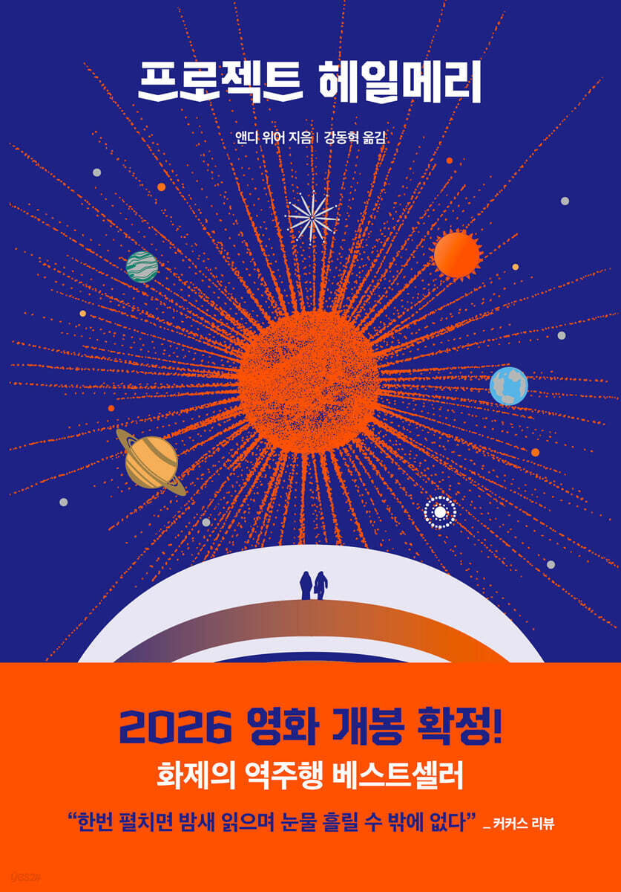

# **독서 기록**
---

# **책 정보**
---

| **제목** | 프로젝트 헤일메리 |
| **저자** | 앤디 위어 |
| **출판** | 알에이치코리아 |
| **발매** | 2021.05.04 |

# **느낀 점**
---
## **수정**
극복형 서사 — 세계관의 기본 값이 희망적이고, 결국 인간성과 선의가 승리한다는 전제를 깔고 진행되는 이야기. 지나치게 희망적이라 현실성은 살짝 떨어지지만, 개인적으로 이런 선의가 가득한 서사를 좋아한다. '프로젝트 헤일메리'가 딱 그런 책이다.

처음엔 그냥 전형적인 SF 소설이라고 생각했다. 우주선, 외계 생명체, 지구를 구하는 임무. 흔하게 볼 수 있는 설정이라 생각했는데, 점점 이야기를 따라가다 보니 이 작품의 본질은 ‘우정’이라는 걸 알게 됐다.

​
우주에서 친구를 만난다 — 사실 이 문장만으로도 마음이 이상해진다. 나는 우주를 상상하면 늘 광활하고, 차갑고, 두려운 공간이라는 생각밖에 들지 않는다. 그곳에서 생명체를 만난다는 것도, 친구가 된다는 것도 믿기 어려운 일인데 이 소설은 그 어려운 확률을 뚫고, 서로를 알아가고, 친구가 되어가는 과정을 따뜻하게 그려냈다.

특히 주인공 ‘라이랜드 그레이스’의 자기희생적인 모습은 참 인상적이었다. 임무 자체가 사실상 자살 임무였고, 기억을 잃은 상태에서 조금씩 상황을 알아가면서 절망해도 이상하지 않을 상황이었다. 그런데 그는 끝까지 싸운다. 지구를, 그리고 어쩌면 자신보다 더 소중해진 친구의 별을 지키기 위해서.

​
그리고 이 소설의 진짜 백미는 인간과 외계 생명체 ‘로키’와의 우정이다. 언어도, 생김새도, 문화도 전혀 다른 두 존재가 서로를 이해하고 협력하는 과정은 보는 내내 마음을 따뜻하게 했다. 우주라는 극한의 환경이 오히려 인간적인 교감과 신뢰를 더 크게 만들어낸다는 사실이 참 아름답게 느껴졌다.

​
이미 영화화가 확정되어 2026년 개봉 예정이라는 소식에 기대감이 크다. 소설 속 장면들이 어떻게 영상으로 구현될지 궁금하다. 특히 ‘로키’가 어떻게 등장할지, 두 존재의 우정이 어떻게 그려질지 매우 기대된다.

오랜만에 마음이 꽉 차는 이야기를 만난 것 같아 참 행복했다. 해피엔딩을 좋아하는 사람이라면, 그리고 한 번쯤 우주에서 친구를 만나보고 싶은 상상을 해본 적이 있다면 꼭 읽어보길.

​
그냥 좋음, 좋음, 좋음!

## **시연**
여기에 느낀 점을 입력하세요.

## **주희**
SF 소설은 정말 재밌다.
생명, 물리, 화학 같은 기초 과학을 벗어나 우주까지다양한 스펙트럼의 과학을 접해보며 그들만의 판타지에 빠진다.
당연하게 지식을 쌓고 보면 더 재밌다.

프로젝트 헤일메리는 밀리 기준 1300p, 실제 책 기준 700p나 되는 장편 소설이다.
주인공 라일랜드 그레이스 박사의 시점으로 현재(우주)에서 기억을 잃은 과거(지구)를 뜨문뜨문 발견하며 장면이 교차되면서 지루한 줄거리 없이 흡입력 있게 속독할 수 있었다.

코마 상태에서 깨어난 주인공이 자기 자신이 누구이며 이곳은 어디인지 하나씩 기억해 내며 유추할 때 몰입도가 굉장했다.
주인공이 왜 우주선일지 앞으로 어떻게 전개될지 궁금해서 끊지 못하고 한 챕터씩 더 읽게 된 것 같다.

상대성 이론, 방사능 노출, 유전학 같은 과학 이론부터 스페이스 X 같은 기업이며 정치까지 실제와 유사한 내용이 있어서 어디까지 사실이며 어디부터 판타지인지 유추하기 어려웠다.
그래서 모든 게 사실일 수도 있겠다 싶은 생각으로 가볍게 접했다.

로키의 등장은 놀라웠다. 외계인이라니.
사실 아스트로파지 자체도 유전 정보를 가진 생명체이기에 이 소설에서는 다른 생명체가 존재할 수 있다고 생각한다.
하지만 예상치도 못한 전개였다.
타우 세티에 도착한 주인공이 왜 이 별만 밝기가 그대로인지 어떻게 연구해낼까 싶었는데 40에리다니 행성의 로키를 맞닥뜨림으로써 자칫 지루할 수 있는 부분을 신선하게 풀어내서 좋았다.

​
로키와 의사소통을 시작하고 서로 과학적인 정보를 주고받고 하는 과정이 너무나 흥미로웠다.
언어를 읽는 방향, 소리를 들을 수 있는 서로의 주파수 범위, 진수, 단위 등 정립하는 과정이 재밌었다.
다른 SF 소설 <삼체>에서는 온갖 정보를 알고있는 사망 직전의 사람의 뇌를 살아있는 상태로 우주로 보내 어딘가에 있을 생명체가 발견해서 우리의 메시지를 받아볼 수 있도록 하는 프로젝트를 진행했다.
실제로 우주로 아레시보 메시지나 동영상을 보낸 적이 있기도 하다. 이러한 외계 생명체와 소통을 원하는 인간의 노력들이 생각이 났다.
SF 영화에서 외계인이 나온다 하면 외계인이 우릴 공격한다거나 이미 소통이 된다고 가정 하에 스토리가 진행되니 않나?
이렇게 서로의 지능이 비슷하다는 전제 하에 상호작용하며 소통의 첫맺음을 보여주는 건 이 책이 처음인 것 같다.
서로 사는 행성이 다르기 때문에 기압 차와 공기 등으로 신체를 맞닿을 수 없다는 점이 현실적이라 좋았다.
서로 같은 목적으로 타우 세니에 왔기에 둘이 합심해서 아스트로파지의 천적 타우메바를 발견하는 완벽한 전개..
주인공-과학자, 로키-엔지니어 서로 협력할 수 있는 관계도 완벽했다.
프로젝트 헤일메리의 시작을 보여주는 과거 장면도 함께 병치되어 나타났는데 물론 중요한 내용이지만 로키와 함께있는 현재 장면이 너무 재밌어서 대충 넘겨보게 되었다.
 

로키의 언어는 하모니카나 멜로디언 같은 관악기로 화음을 내고 있다고 상상했다.
로키의 말투가 -음 과 같은 종결어미를 쓰는 게 재밌었다.
스프레드시트 또는 주인공 머리로 번역한 번역어겠지만 실제로 로키가 이렇게 말하고 있을 것 같아서 더 귀여웠다.

>네 얼굴에서 물이 샘.

>왜 인간은 물 이렇게 많이 필요, 질문? 비효율적인 생명체!

>내 주먹에 하이해.

>게으른 인간. 가서 가져와!

>좋음, 좋음, 좋음!

​

원문으로 읽었으면 로키의 말투를 느끼지 못했을 것 같다.

>Good, Good, Good!

>좋아요, 좋아요, 좋아요!

>좋습니다, 좋습니다, 좋습니다!

>좋다, 좋다, 좋다!

>좋음, 좋음, 좋음!
​

좋음 좋음 좋음이 최고다. 한국어 번역이 정말 완벽하다.

주인공이 자살 임무를 수행하러 온 줄 알았으나 마지막 기억이 떠오르면서 겁쟁이 인간으로 자기 스스로를 표현하지만, 지구로 돌아가던 와중 로키를 구하러 감으로써 자살 임무를 재수행하려고 한다.
지구에 도착해서 영웅이 된 주인공. 로키를 그리워하며 과학을 발전시켜 언젠간 다시 만나는 결말일 줄 알았는데 지구에 돌아가지 않고 결국 40에리다니에 거주하게 되는 또 예상치 못한 전개를 보여주었다.
식량 문제를 주로 삼으면서 어쨋든 해피엔딩으로 결말을 보여주는 게 마션과 비슷했다. 마무리까지 판타지스러웠다.

에리다니에 거주하게 된 주인공이 에리디언어를 완벽히 흡수하여 우주선에서의 로키의 딱딱한 말투와 다르게 반말, 존댓말, 의문형까지 제대로 알아듣고 있다는 게 표현돼서 좋았다.

주인공은 소설 내내 보여준 교육자의 자질을 에리다니에서도 이어 나간다는 해피 엔딩이 좋았다.
오르곤으로 에리디언어을 사용해서 수업을 진행한다는 점이 교육자의 입장으로 잘 구현된 것 같다.
​

## **후정**
여기에 느낀 점을 입력하세요.
