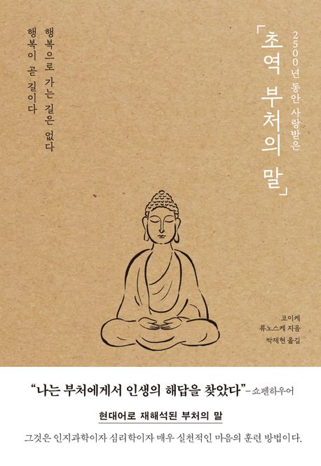

# **독서 기록**
---

# **책 정보**
---

| **제목** | 초역 부처의 말 (2500년 동안 사랑받은) |
| **저자** | 코이케 류노스케    |
| **출판** | 포레스트북스   |
| **발매** | 2024-05-30  |

# **느낀 점**
---
## **수정**
여러 불교 서적을 접하면서 느낀 점은, 불교 사상의 본질이 결국 ‘공 사상(空思想)’으로 귀결된다는 것이다. 공 사상이란 모든 만물이 고정된 실체 없이 서로 의존적으로 존재한다는 개념이다.

​
내가 처음 불교에 관심을 갖게 된 계기는 반야심경 해석본이었다. 그 책을 통해 이전까지 단편적으로 알고 있던 불교 지식들이 하나로 정리되었고, 무엇보다도 불교적인 삶의 태도가 내게 큰 영향을 주었다.

요즘 들어 불교는 젊은 세대 사이에서도 조용히 인기를 끌고 있다. 나 역시 최근 불교박람회에 다녀왔는데, 트렌디한 불교 굿즈들을 판매하며 대중과의 거리를 좁히려는 모습이 인상 깊었다. 내 추측이지만, 복잡하고 불확실한 사회 속에서 마음의 평온을 찾고자 하는 청년들에게 불교 교리가 마음에 울림을 주는 것 같다고 느꼈다. 실제로 종교를 설명할 때 ‘무교에 가까운 불교’라고 말하는 이들이 많은데, 나 또한 그런 부류에 속한다고 생각한다.

이 책에서 가장 인상 깊었던 교리는 ‘화내지 않는 것’에 대한 가르침이었다. 단순히 화를 참는 것이 아니라, 분노라는 감정 자체가 생기지 않는 경지에 대한 이야기였다. 그 개념은 내게 큰 울림을 주었고, 모든 교리를 실천하지는 못하더라도 이 부분만큼은 삶 속에서 지키려 꾸준히 노력하고 있다.

책 자체는 불교 사상을 매우 쉽고 간결하게 풀어낸 구성이라, 남녀노소 누구나 부담 없이 읽을 수 있다. 또한 잠언집 형식으로 되어 있어 짬짬이 읽을 수 있어서 좋은 책이었다.

## **시연**
여기에 느낀 점을 입력하세요.

## **주희**
어렸을 때부터 엄마를 따라 절에 다녔고, 그래서 불교 사상이 자연스럽게 나에게 스며들었던 것 같다.
한동안은 절에 가지 않았는데, 요즘 들어 다시 불교에 관심이 생기면서 부처님의 말씀을 직접 공부해보고 싶다는 생각이 들었다.
마침 『초역 부처의 말』이라는 책이 베스트셀러에 올라와 있길래 관심이 갔었고, 기대를 안고 펼쳤다.

막상 읽어보니 이 책은 제목 그대로 ‘초역’, 즉 부처님의 말씀을 현대적으로 다시 풀어쓴 문장들이었고, 원문에 충실한 번역이라기보다는 번역가의 해석과 의도가 담긴 명언집에 가까웠다.
그래서 처음엔 조금 아쉬운 마음이 들었다. 이러한 느낌의 법정 스님 말씀 책은 집에도 많이 꽂혀있기 때문이다.
하지만 책을 계속 읽다 보니 오히려 그런 점이 이 책의 장점일 수도 있겠다는 생각이 들었다.
불교 신자가 아니더라도 누구나 편하게 읽을 수 있도록 현대인의 시선으로 재해석된 문장들은 마음을 정리하고 나 자신을 돌아보는 데 꽤 도움이 되었기 때문이다.
​

> 좋은 일이 떠올랐다면 곧 행동으로 옮긴다 (p.64)
무언가를 하려는 마음을 갖는 건 쉽지만 실행에 옮기는 건 어렵다.
사소한 것부터 몸과 마음을 움직여보자.
어제는 가고 싶었던 카페에 가서 맛있는 디저트도 먹고 밀렸던 책도 읽었다.
그리고 집 앞 초등학교 운동장으로 일단 나가 무작정 뛰었다.
1km도 뛰기 힘들거라고 생각했던 내가 3km을 쉬지 않고 뛰었다.
내가 하고자 했던 일을 하니 주말을 온전히 나를 위해 쓴 것 같다.

​
> 비뚤어진 애정이라는 속박 (p.82)
복잡하고 힘든 시기를 지나고 있던 나에게 와닿았던 구절.
주변 사람들에게 바라기만 하는 건 잘못된 것이였고 반성하게 된다.
완전히 이 속박에서 벗어날 수 없겠지만 이 구절을 되새길 수 있도록 해야지.

> '지금, 이 순간'에 마음을 모은다 (p.170)
과거를 자주 돌이키고 미래를 두려워하는 나를 위한 구절.
지금, 이 순간에 전념하자.

> 제행무상 (p.172)
불교의 죽음, 모든 것은 영원하지 않다.
앞서 '지금, 이 순간에 마음을 모은다' 구절과 이어진다고 생각한다.
모든 것은 소멸하니 집착하지 않고 지금, 이 순간을 헛되이 보내지 말도록 하자.

​
> 유언 (p.190)
앞으로 배우고 싶은 삶의 태도와 자세에 대해 생각하게 되었고,
고통의 원인을 이해하고 단순하고 너그럽게 살아가고 싶다는 마음이 들었다.
특히 인상 깊었던 건 마지막에 다룬 '죽음'에 대한 불교적 시선이었다.
죽음을 두려움이나 슬픔으로만 보지 않고, 삶의 일부로 받아들이는 시선이 신선했고 마음에 오래 남았다.
삶과 죽음을 관통하는 그 담담한 통찰이 어쩌면 지금의 나에게 가장 필요한 가르침이었는지도 모르겠다.

내가 기대했던 깊이 있는 불경 해석서는 아니었지만, 오히려 그 덕분에 부담 없이 읽을 수 있었고,
일상 속에서 부처님의 지혜를 가볍게 마주할 수 있었던 책이었다.
다시 불교에 관심을 가지게 된 나에게 좋은 출발점이 되어준 고마운 책이다.

장원영 대단해

## **후정**
여기에 느낀 점을 입력하세요.
