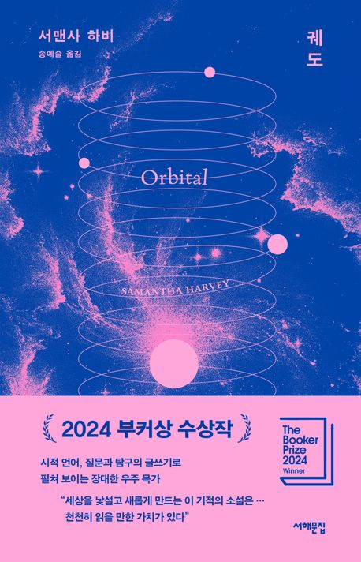

# **독서 기록**
---

# **책 정보**
---

| **제목** | 궤도 |
| **저자** | 서맨사 하비    |
| **출판** | 서해문집  |
| **발매** | 2025.06.20   |

# **느낀 점**
---
## **수정**
이 책을 읽는 내내 "난해하다"라는 감정이 가장 크게 남았다. 이전에 프로젝트 헤일메리를 읽으면서 비슷한 종류의 우주 이야기를 상상했는데, 이 작품은 전혀 다른 결을 가지고 있었다. 우주 탐사와 생존 같은 외적 사건보다는, 우주여행에 참여한 여섯 명의 심리와 내면을 풀어내는 듯한 느낌이었다.

​
솔직히 말하면, 우주에 실제로 가본 사람은 극히 소수일 텐데, 과연 얼마나 많은 독자가 이 경험과 감정을 공감할 수 있을까 하는 의문이 들었다. 특히 내가 이해하기 힘든 과학적 개념들이 많이 등장해서 읽는 내내 따라가기 어려웠다.

그런데도 이 책이 2024년 부커상을 받았다는 사실은 조금 놀라웠다. 왜 이 작품이 상을 받았는지 도무지 추측이 잘 되지 않아 GPT에게 물어보았다. 그 설명에 따르면, 부커상 수상 기준은 스토리 자체보다 새로운 형식과 언어로 인간을 어떻게 탐구했는가를 더 중시하는 경향이 있다고 한다. 이 작품 역시 전통적인 플롯 구조에서 벗어난 실험성과 독창성이 높은 평가를 받은 것이라 했다. 그래서 나 같은 일반 독자들에게는 다소 난해하고 낯선 느낌으로 다가온 것 같다.

결론적으로 나는 이 책을 다 읽었지만, 온전히 이해하지 못해 다 읽은 것 같지 않은 느낌이 들었다. 솔직한 심정으로는 책을 다 읽고 나서도 작가가 무엇을 전달하려 했는지 잘 모르겠고, 그저 ‘이런 작품이 부커상을 받는구나’라는 생각만 들었다..

## **시연**
여기에 느낀 점을 입력하세요.

## **주희**
지구 궤도를 도는 여섯 명의 우주비행사들의 하루를 따라가며 펼쳐지는 내면적 성찰의 이야기다.
처음에는 각종 에피소드가 이어지는 모험담일 것이라 기대했으나,
이 소설은 우주 속 침묵과 암흑 속에서 유일하게 빛나는 지구를 바라보는 인간의 내밀한 생각과 감정에 초점을 맞춘다.

지구 안에서 살아갈 때는 스스로를 중심으로 여길 수 있겠지만,
지구 바깥에서 내려다본 순간 우리는 무수한 별들 속 아주 작은 존재일 뿐임을 깨닫게 된다.
무한한 우주 속에서는 우주비행사도 영웅이 아니라 먼지일 뿐이다.
지구를 바라보며 가족, 기억, 미래, 지구의 위기, 그리고 존재의 이유에 대한 물음이 겹겹이 쌓일 때마다 나도 함께 지구라는 별을 바라보는 기분이 들었다.
우주의 먼지라도 우리는 여전히 살아가고 있다.

과학적 배경 위에서 이야기가 펼쳐지지만, 책을 읽는 내내 나는 SF 소설이라기보다 오히려 철학에 가까운 작품을 접하고 있다는 느낌을 받았다.
문장을 깊게 되새기는 것보다 물 흐르듯 가볍게 읽을 때 그 속에 담긴 울림과 문학적 아름다움이 다가왔다.
다만 특정 단어가 볼드체로 강조되는 부분은 다소 의아했는데, 원문의 의도를 살린 것인지, 번역상의 어색함인지 의문이 남았다.
​

우리의 존재가 얼마나 작은 존재인지, 그럼에도 얼마나 치열하게 살아가는지 일깨워주었다.

## **후정**
여기에 느낀 점을 입력하세요.
