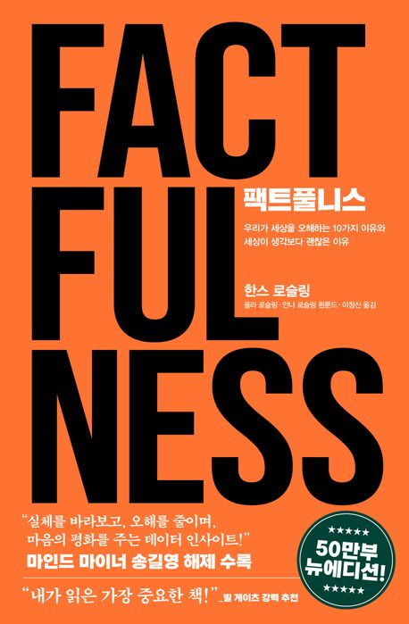

# **독서 기록**
---

# **책 정보**
---

| **제목** | 팩트풀니스 |
| **저자** | 한스 로슬링, 올라 로슬링, 안나 로슬링 뢴룬드    |
| **출판** | 김영사  |
| **발매** | 2024.09.01   |

# **느낀 점**
---
## **수정**
밀리 랭킹을 보다가 설명이 흥미롭게 느껴져 이 책을 선택하게 되었다. 특히 도입부가 인상 깊었는데, 저자가 “입에 칼을 넣을 수 있다"라는 이야기를 꺼내고 실제 강연에서는 정말로 칼을 입에 넣어 보여준다는 장면이 마음을 끌었다. 만약 내가 강연을 들었다면 ‘진짜 가능할까? 식도 다치지 않나?’ 같은 의심을 하다가도 결국 눈으로 직접 증거를 보면 믿게 되었을 것이다. 저자가 전하고 싶어 하는 메시지와 전달 방식이 느껴져서 더욱 마음이 갔던 것 같다.

​
이 책은 사람들이 세상을 실제보다 훨씬 더 부정적으로, 더 나쁘게 인식한다는 사실을 지적한다. 많은 이들이 “세상은 점점 나빠지고 있다"라고 생각하지만, 실제 지표를 보면 인류는 여러 면에서 꾸준히 발전해 왔다. 저자는 이러한 잘못된 인식이 생기는 원인을 “10가지 본능”으로 설명하며, 각 본능을 퀴즈와 함께 제시한 뒤 정답과 근거를 알려주는 방식으로 풀어나간다. 이를 통해 독자는 직관이 얼마나 왜곡될 수 있는지를 깨달을 수 있다.

​
읽으면서 놀랐던 사실 중 하나는 “여성이 임신하면 약 2년 정도 생리를 하지 않는다"라는 부분이었다. 아무리 생각해도 연년생도 있고 말이 안 되는 것 같아서 검색을 좀 해봤는데, 모유 수유 시에 그럴 수 있다고는 하지만 평균적으로는 1~3개월이면 다시 시작한다는 의견이 많았다. 완전히 틀린 말은 아니지만, 그렇다고 완전히 맞는 내용도 아니다. 책의 주제와 달리 혼란을 줄 수 있는 정보가 적혀있는 게 의아했다. 덕분에 ‘책의 모든 내용이 반드시 정확한 것은 아닐 수 있겠구나’라는 생각도 하게 되었다. 혹시 일부러 독자에게 의심하면서 읽으라고 넣은 문장인가 싶기도 하고.. 여성의 임신 후 생리를 다시 하게 되는 기간이 갑자기 변동될 정도로 유동적인 정보도 아닌데..

전체적으로 새로운 지식을 습득할 수 있는 책이었다. 특히 우리가 세상을 바라보는 방식이 얼마나 왜곡될 수 있는지, 또 데이터를 근거로 사고하는 태도가 왜 중요한지를 다시금 느낄 수 있었다. 다만 일부 정보는 사실 여부를 확인해가며 읽을 필요가 있다는 점에서, ‘팩트풀니스’라는 제목이 무색하게 느껴지는 부분도 있었다.

## **시연**
여기에 느낀 점을 입력하세요.

## **주희**
여기에 느낀 점을 입력하세요.

## **후정**
여기에 느낀 점을 입력하세요.
